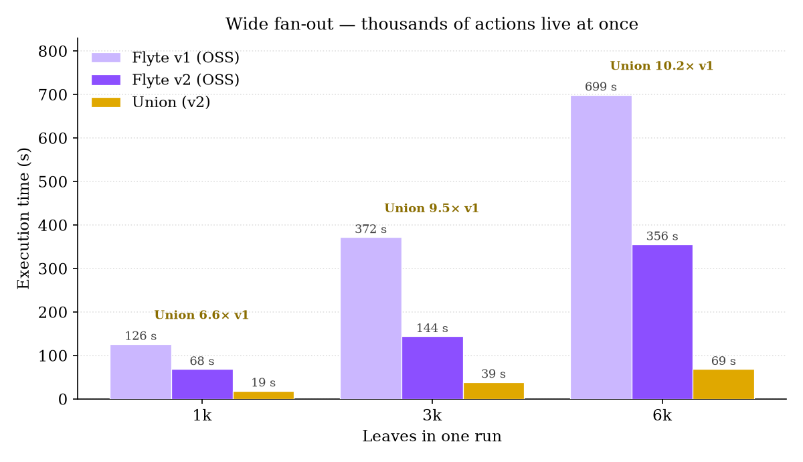
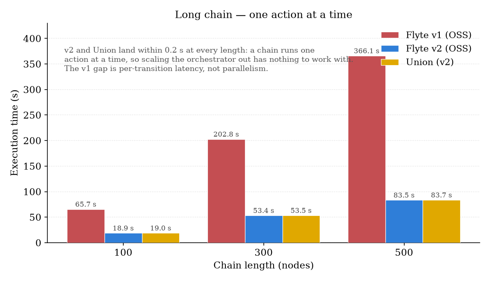
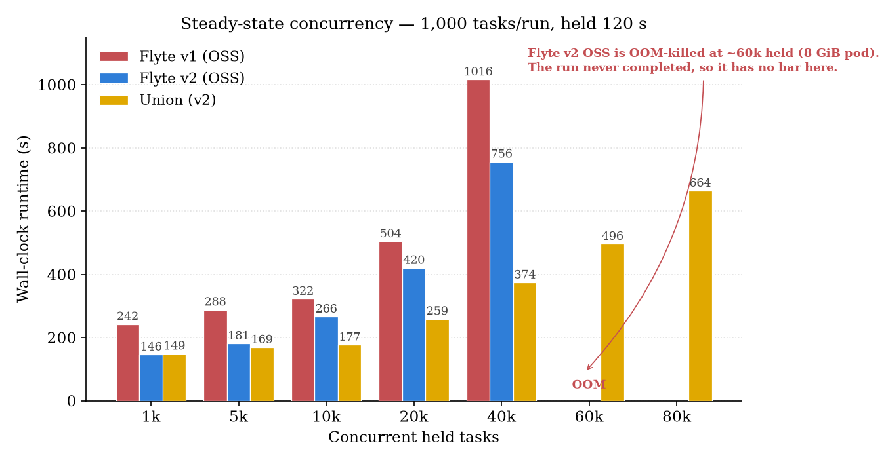
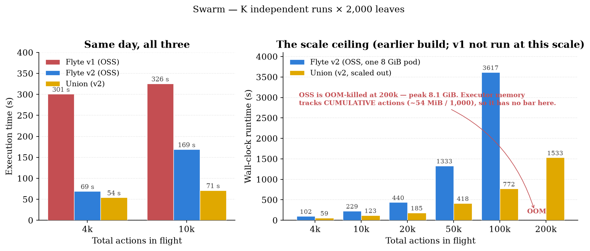

# benchmark

Reproducible **Flyte scaling benchmarks**, packaged as a Claude Code plugin.
Compares **Flyte v1**, **Flyte v2 (OSS)**, and **Union** on the same workloads
and collects wall-clock, peak memory, and OOM results.

This repo is a Claude Code **plugin marketplace** (`benchmark`) hosting one plugin
(`flyte-benchmark`). You can install it through Claude Code, or just clone the repo
and run the scripts directly — no Claude required.

---

## Install (Claude Code plugin)

```text
/plugin marketplace add flyteorg/benchmark
/plugin install flyte-benchmark@benchmark
```

Then invoke the skill:

```text
/flyte-benchmark:flyte-benchmark
```

Claude will walk you through running the workloads against whichever cluster your
Flyte config points at, collecting results, and comparing them to the reference
numbers.

To try it before it's on GitHub (local test):

```bash
/plugin marketplace add /path/to/this/repo
/plugin install flyte-benchmark@benchmark
```

---

## What it measures

Four workload shapes. Leaves are **core-sleep** tasks that run with no task pod,
so you measure *orchestration* cost, not pod startup.

| shape | what it stresses |
|---|---|
| `fanout` | one run, N parallel leaves — wide breadth |
| `long_chain` | N nodes in series — sequential depth |
| `concurrency` | hold M leaves live for a window — steady-state load |
| `swarm` | K independent fan-out runs at once — the scale / OOM test |

Metrics: end-to-end **wall-clock** (from the driver) and **peak memory + OOM** of
the orchestration pod (via `kubectl top`).

---

## Results at a glance

Every figure below covers all three — **Flyte v1**, **Flyte v2 (OSS)** and
**Union** — on core-sleep leaves with the same driver. The fan-out, long-chain
and low-end swarm numbers were re-measured on one day so the three are directly
comparable; the concurrency and high-scale swarm numbers are from an earlier
build and are labelled as such. Full tables in
[`reference_results.md`](flyte-benchmark/skills/flyte-benchmark/reference_results.md);
regenerate with `uv run charts/make_charts.py`.

**Wide fan-out** — thousands of actions live at once, so a scaled-out
orchestrator has something to parallelize: Union finishes a 6,000-leaf run 10× faster than v1 and
5× faster than a single-pod v2.



**Long chain** — the counter-example. One action at a time means nothing to
parallelize: v2 and Union land within 0.2 s of each other at every length, while
v1 pays ~4× on per-transition latency alone.



**Steady-state concurrency** — v2 is 1.2–1.7× faster than v1 across the range.
Both OSS deployments are bounded by a single pod's memory: the v2 executor is
OOM-killed at ~60k held tasks (no bar — the run never finished), while Union runs
the same v2 orchestrator scaled out and reaches 80k.



**Swarm** — K independent runs at once. All three at a scale they all handle
(left), and how far the OSS deployment gets before it dies (right): executor
memory tracks *cumulative* actions at ~54 MiB per 1,000, so an 8 GiB pod is
OOM-killed near 150k and the 200k run never finished. Union completes all 100.



Peak orchestrator memory is the other half of the story: down a 500-node chain
v1 grows 1,272 → 1,589 MiB while v2 stays flat at 298 → 327 MiB. Union's orchestrator is
hosted and multi-tenant, so a pod-RSS number there isn't comparable and is not
reported.

---

## Usage (run it yourself)

Eight scripts under `scripts/`, four per Flyte version, one per shape — no venv
to build:

```
scripts/v2/{fanout,long_chain,concurrency,swarm}.py     Flyte v2 SDK
scripts/v1/{fanout,long_chain,concurrency,swarm}.py     flytekit
scripts/plot_results.py                                 shared
```

Each script carries its own dependencies in a [PEP 723](https://peps.python.org/pep-0723/)
header, so `uv run` installs them (and a Python 3.12) on first use. The two
versions take **identical flags**, so comparing them is the same command twice:

```bash
git clone https://github.com/flyteorg/benchmark && cd benchmark
export FLYTECTL_CONFIG=~/.flyte/config.yaml    # <- the cluster under test

uv run scripts/v2/fanout.py --n 1000                   # Flyte v2
uv run scripts/v1/fanout.py --n 1000                   # ...the same shape on v1
```

The four shapes, with the knobs worth sweeping:

```bash
uv run scripts/v2/fanout.py      --n 6000              # one run, 6,000 parallel leaves
uv run scripts/v2/long_chain.py  --length 500          # 500 nodes in series
uv run scripts/v2/concurrency.py --m 40000 --hold 120  # hold 40k leaves live
uv run scripts/v2/swarm.py       --k 25 --n 2000       # 25 concurrent runs = 50k actions
```

Each prints a `RESULT_JSON:{...}` line. Append them to one file to chart later,
and loop in the shell to sweep:

```bash
for n in 1000 2000 3000 4000 5000 6000; do uv run scripts/v2/fanout.py --n $n | tee -a results.jsonl; done
for l in 100 300 500;                    do uv run scripts/v2/long_chain.py --length $l | tee -a results.jsonl; done
for m in 1000 5000 10000 20000 40000;    do uv run scripts/v2/concurrency.py --m $m --hold 120 | tee -a results.jsonl; done
for k in 2 5 10 25 50 100;               do uv run scripts/v2/swarm.py --k $k --n 2000 | tee -a results.jsonl; done
```

Run the **same commands against each cluster** (swap `FLYTECTL_CONFIG`) so the
comparison is apples-to-apples. Both SDKs read that variable themselves, so
there is nothing benchmark-specific to configure. Failed runs are reported,
never relaunched — a retry budget makes two clusters incomparable unless both use
the same one.

### Peak memory + OOM

Wall-clock is only half the story — the other half is what the orchestration pod
does to its memory limit. Watch it while a workload runs:

```bash
kubectl -n flyte top pod -l app.kubernetes.io/name=flyte-binary --containers
kubectl -n flyte get pod -l app.kubernetes.io/name=flyte-binary \
  -o jsonpath='{.items[*].status.containerStatuses[*].restartCount}'
```

A restart count that goes up mid-run means the pod was OOM-killed (exit 137) —
which is a result, not a failed measurement: it locates the ceiling.

### Summarize + compare

```bash
uv run scripts/plot_results.py results.jsonl --out charts
# summary table, plus charts_walltime.png and charts_memory.png
```

Compare your numbers to
[`reference_results.md`](flyte-benchmark/skills/flyte-benchmark/reference_results.md).
Absolute values depend on cluster size / DB / network, but the **shape** should
reproduce: v2 beats v1 on every workload (~2× on a fan-out, ~3.5–4.4× on a long
chain, ~1.2–1.7× on held concurrency in our runs), Union pulls further ahead
wherever actions run concurrently, and a single-pod OSS executor OOMs the 200k
swarm that Union completes.

---

## Recommended sweeps

| shape | flag | sweep |
|---|---|---|
| `fanout` | `--n` | 1000 → 6000 (v1 OOMs a *held* fan-out ~6k; v2 stays flat) |
| `long_chain` | `--length` | 100 → 500 |
| `concurrency` | `--m` | 1000 → 40000, with `--hold 120` |
| `swarm` | `--k` | 2 → 100, `--n 2000` (up to 200k actions) |

---

## Prerequisites

- [`uv`](https://docs.astral.sh/uv/) — it installs each script's dependencies
  (and a Python 3.12) on first run. Nothing else to install; the two SDKs never
  meet, since each script resolves in its own environment.
- A Flyte config **per target cluster** (v1, v2-OSS, Union). Both SDKs discover
  it the usual way: `FLYTECTL_CONFIG`, else `./config.yaml` / `./.flyte/config.yaml`
  (v2 only), else `~/.flyte/config.yaml`.
- Runs land in **flytesnacks / development** on every cluster, so results stay
  comparable; override with `FLYTE_BENCH_PROJECT` / `FLYTE_BENCH_DOMAIN`.
- For memory sampling: `kubectl` access to the orchestration pod + `metrics-server`.

## Fairness checklist

- Same task image and driver on every cluster; no relaunching failed runs.
- core-sleep leaves (no pods) so node memory never masks the orchestrator's limit.
- v1 executions launch with `--max-parallelism 1000` to match the v2 SDK default —
  flytepropeller's ~25 would throttle wide fan-outs for a reason that has nothing
  to do with how it orchestrates.
- Wipe CRDs / let pod memory settle between runs (leftover state inflates the
  informer cache and confounds the next measurement).

## Layout

```
benchmark/
  scripts/
    v1/                                     <- 4 benchmarks on flytekit + _common.py
    v2/                                     <- the same 4 on the Flyte v2 SDK
    plot_results.py                         <- summary table + charts
  charts/                                   <- README charts + make_charts.py
  .claude-plugin/marketplace.json           <- marketplace catalog
  flyte-benchmark/                          <- the plugin
    .claude-plugin/plugin.json
    skills/flyte-benchmark/
      SKILL.md                              <- skill instructions
      reference_results.md                  <- numbers to compare against
```

The benchmarks sit in `scripts/` so they can be run directly from a clone; the
skill is instructions for driving them, not a second copy of them.

## License

Apache-2.0
