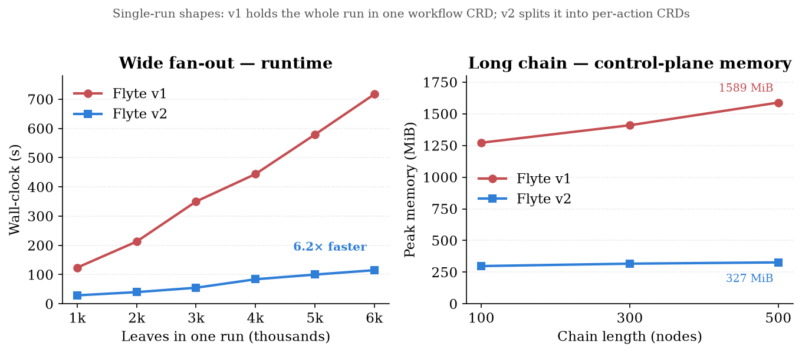

# benchmark

Reproducible **Flyte control-plane scaling benchmarks**, packaged as a Claude Code
plugin. Compares **Flyte v1**, **Flyte v2 (OSS)**, and **Union** on the same
workloads and collects wall-clock, peak memory, and OOM results.

This repo is a Claude Code **plugin marketplace** (`benchmark`) hosting one plugin
(`flyte-benchmark`). You can install it through Claude Code, or just clone the repo
and run the scripts directly — no Claude required.

---

## Install (Claude Code plugin)

```text
/plugin marketplace add flyteorg/benchmark
/plugin install flyte-benchmark@benchmark
```

Then invoke the skill:

```text
/flyte-benchmark:flyte-benchmark
```

Claude will walk you through running the workloads against whichever cluster your
Flyte config points at, collecting results, and comparing them to the reference
numbers.

To try it before it's on GitHub (local test):

```bash
/plugin marketplace add /path/to/this/repo
/plugin install flyte-benchmark@benchmark
```

---

## What it measures

Four workload shapes. Leaves are **core-sleep** tasks that run with no task pod,
so you measure *orchestration* cost, not pod startup.

| shape | what it stresses |
|---|---|
| `fanout` | one run, N parallel leaves — wide breadth |
| `long_chain` | N nodes in series — sequential depth |
| `concurrency` | hold M leaves live for a window — steady-state load |
| `swarm` | K independent fan-out runs at once — the scale / OOM test |

Metrics: end-to-end **wall-clock** (from the driver) and **peak memory + OOM** of
the orchestration pod (from `sample_mem.sh`).

---

## Results at a glance

Measured runs — identical 8 GiB orchestration pods for Flyte v1 and Flyte v2
(OSS), core-sleep leaves, same driver and retry budget everywhere. Full tables in
[`reference_results.md`](flyte-benchmark/skills/flyte-benchmark/reference_results.md);
regenerate the charts with `python charts/make_charts.py`.

**Steady-state concurrency** — the one shape run on all three planes. v2 is
1.2–1.7× faster than v1 across the range; both OSS planes are bounded by a single
pod's memory, and the OSS v2 executor is OOM-killed at ~60k held tasks. Union runs
the same v2 plane scaled out and keeps going to 80k.


**Single-run shapes** — v1 keeps the whole run in one workflow CRD, so a single
reconcile loop churns it on every tick and its footprint grows with the run. v2
splits the run into per-action CRDs: ~6× faster on a wide fan-out and flat memory
down a long chain.



**Long chain** — the counter-example, and the reason the shapes above matter.
Re-run on both an OSS v2 cluster and Union on the same day: every point lands
within 0.2 s. A chain executes one action at a time, so there is nothing for a
scaled-out plane to parallelize — runtime is just length × per-transition latency.


**Swarm scale test** — K independent runs × 2,000 leaves. OSS executor memory
tracks *cumulative* actions (~54 MiB per 1,000), so an 8 GiB pod dies around 150k;
the 200k run never finished. Union holds action state in a distributed store and
completes all 100 runs.


---

## Usage (run it yourself)

Eight scripts, four per control plane, one per shape — no venv to build:

```
scripts/v2/{fanout,long_chain,concurrency,swarm}.py     Flyte v2 SDK
scripts/v1/{fanout,long_chain,concurrency,swarm}.py     flytekit
scripts/{sample_mem.sh,plot_results.py}                 shared
```

Each script carries its own dependencies in a [PEP 723](https://peps.python.org/pep-0723/)
header, so `uv run` resolves them on the fly. The two planes take **identical
flags**, so comparing them is the same command twice:

```bash
git clone https://github.com/flyteorg/benchmark && cd benchmark
export FLYTE_BENCH_CONFIG=~/.flyte/config.yaml    # <- the cluster under test

uv run flyte-benchmark/skills/flyte-benchmark/scripts/v2/fanout.py --n 1000
uv run flyte-benchmark/skills/flyte-benchmark/scripts/v1/fanout.py --n 1000
```

Or through the Makefile, which picks the plane with `V=` and appends every
`RESULT_JSON:` line to `results.jsonl`:

```bash
make help                              # all targets + current defaults

make fanout      V=v2 N=6000           # one run, 6,000 parallel leaves
make fanout      V=v1 N=6000           # ...the same shape on a v1 cluster
make long_chain  V=v2 L=500
make concurrency V=v2 M=40000 HOLD=120
make swarm       V=v2 K=25 N=2000      # 50k actions

make sweep       V=v2                  # fanout + chain + concurrency ranges
make sweep-swarm V=v2                  # ramp K 2 -> 100 (up to 200k actions)
```

Run the **same commands against each cluster** (swap `FLYTE_BENCH_CONFIG`) so the
comparison is apples-to-apples. For v1, point `scripts/v1/config.yaml` at your
flyteadmin (or override it with `FLYTE_BENCH_CONFIG`). Failed runs are reported,
never relaunched — a retry budget makes two clusters incomparable unless both use
the same one.

### Peak memory + OOM

Run in a second terminal while a workload executes:

```bash
make mem                                                          # v2 / OSS flyte-binary pod
make mem SEL=app.kubernetes.io/name=flytepropeller CONT=flytepropeller   # v1
# -> PEAK_MEM_MIB=2032 RESTARTS_DELTA=0   (RESTARTS_DELTA>0 => OOMKilled, exit 137)
```

### Summarize + compare

```bash
make report      # summary table, plus charts_walltime.png / charts_memory.png
```

Compare your numbers to
[`reference_results.md`](flyte-benchmark/skills/flyte-benchmark/reference_results.md).
Absolute values depend on cluster size / DB / network, but the **shape** should
reproduce: v2 is ~4.3–6.5× faster than v1 with no per-run OOM cliff, and the OSS
executor OOMs the 200k swarm that Union completes.

---

## Recommended sweeps

| shape | flag | sweep |
|---|---|---|
| `fanout` | `--n` | 1000 → 6000 (v1 OOMs a *held* fan-out ~6k; v2 stays flat) |
| `long_chain` | `--length` | 100 → 500 |
| `concurrency` | `--m` | 1000 → 40000, with `--hold 120` |
| `swarm` | `--k` | 2 → 100, `--n 2000` (up to 200k actions) |

---

## Prerequisites

- [`uv`](https://docs.astral.sh/uv/) — it installs each script's dependencies
  (and a Python 3.12) on first run. Nothing else to install; the two SDKs never
  meet, since each script resolves in its own environment.
- A Flyte config **per target cluster** (v1, v2-OSS, Union), selected with
  `FLYTE_BENCH_CONFIG` (default `~/.flyte/config.yaml`; the v1 scripts fall back
  to `scripts/v1/config.yaml`).
- For memory sampling: `kubectl` access to the orchestration pod + `metrics-server`.

## Fairness checklist

- Same task image and driver on every cluster; no relaunching failed runs.
- core-sleep leaves (no pods) so node memory never masks the control-plane limit.
- v1 executions launch with `--max-parallelism 1000` to match the v2 SDK default —
  flytepropeller's ~25 would throttle wide fan-outs for a reason that has nothing
  to do with its control plane.
- Wipe CRDs / let pod memory settle between runs (leftover state inflates the
  informer cache and confounds the next measurement).

## Layout

```
benchmark/                                  <- marketplace repo
  Makefile                                  <- run any shape on either plane
  .claude-plugin/marketplace.json           <- marketplace catalog
  charts/                                   <- README charts + make_charts.py
  flyte-benchmark/                          <- the plugin
    .claude-plugin/plugin.json
    skills/flyte-benchmark/
      SKILL.md                              <- skill instructions
      reference_results.md                  <- numbers to compare against
      scripts/
        sample_mem.sh, plot_results.py      <- shared by both planes
        v2/                                 <- 4 benchmarks (Flyte v2 SDK) + _common.py
        v1/                                 <- the same 4 on flytekit + config.yaml
```

## License

Apache-2.0
